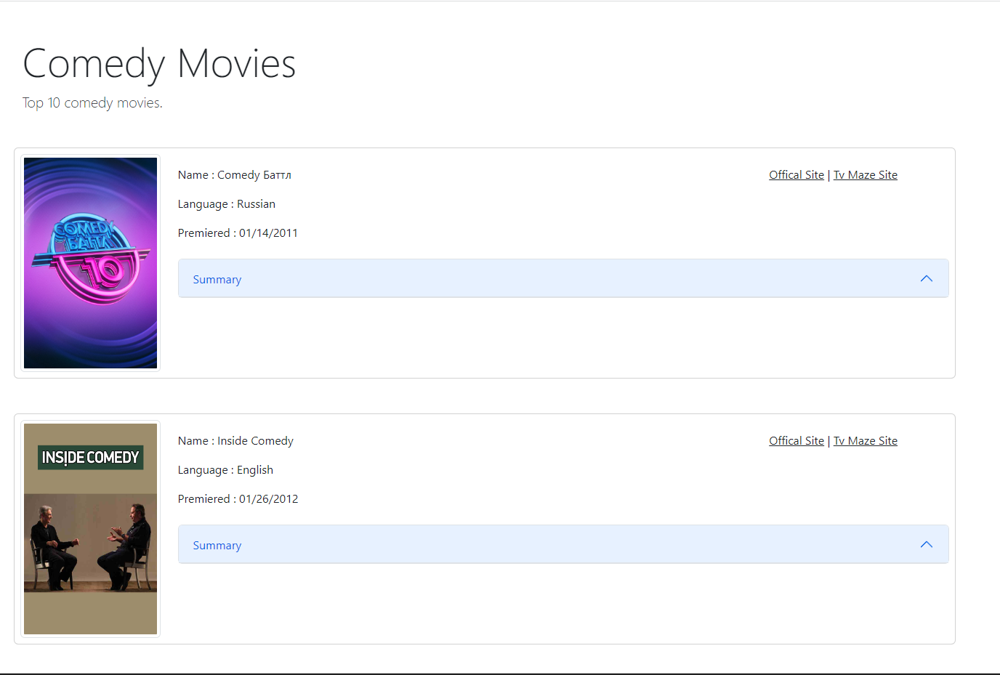

#### Command that receives data from remote server and import to database with API.

* composer install
* set environment
* php bin/console doctrine:database:create
* php bin/console doctrine:schema:update --force
* php bin/console app:insert-command-movie

----------------------------------------------

